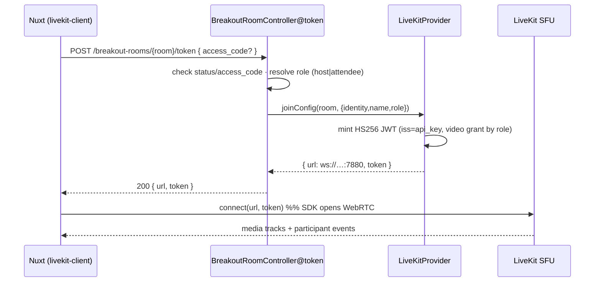
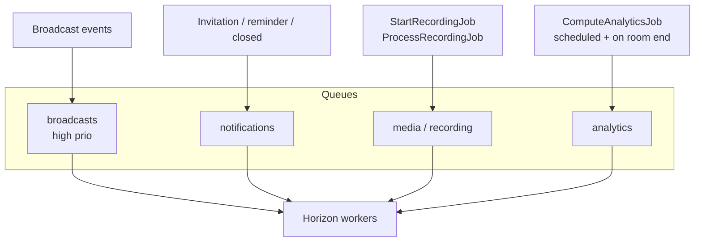
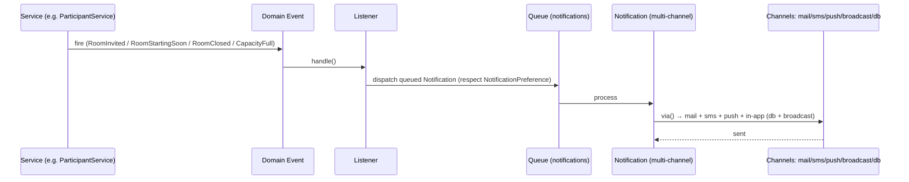
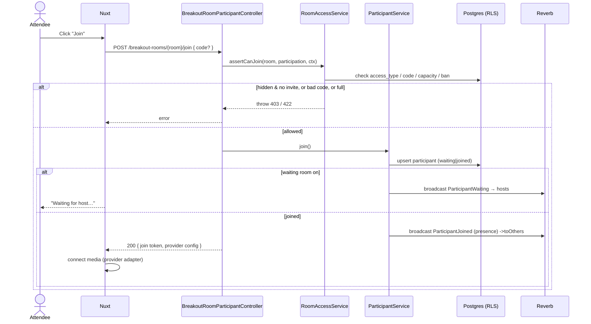
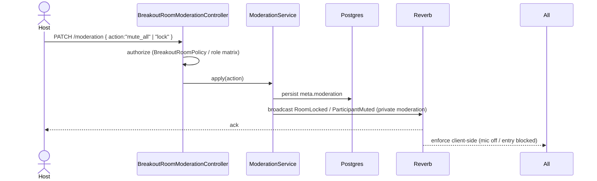
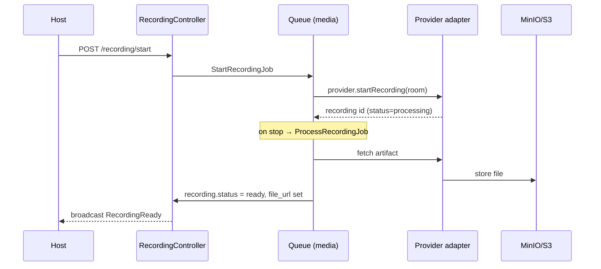
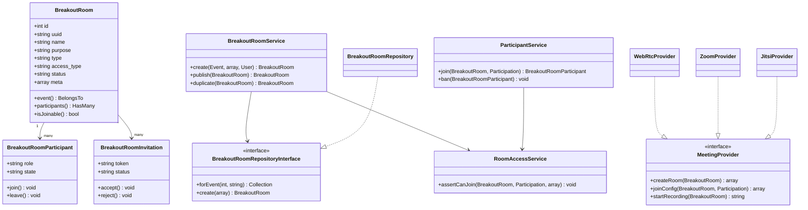

# Breakout Rooms — Module Architecture

Enterprise design for the **Event Engagement › Breakout Rooms** module: virtual,
collaborative rooms attendees join live during an event. This document is the
blueprint the shipped v1 grows into.

- **Stack:** Laravel 11 API (`eventos-api`) · Nuxt (`eventos-admin`) · PostgreSQL (+ RLS) · Redis · **Laravel Reverb** (WebSockets) · **Horizon** (queues) · MinIO/S3 (media).
- **Tenancy:** every table carries `organization_id`, guarded by `BelongsToOrganization` (app scope) **and** Postgres Row-Level Security on the `app.current_organization` GUC (§4.3 of the platform arch).

## Shipped now (v1) vs. Roadmap

| Area | v1 (in code today) | Roadmap (this doc) |
|------|--------------------|--------------------|
| Room CRUD | ✅ `breakout_rooms` table, controller, resource, Vue page | — |
| Room Details (name, description, purpose, schedule, access anyone/coded/hidden, poster) | ✅ | — |
| Types / draft-publish-archive / duplicate | ✅ | — |
| Participants, invitations, waiting room | `meta` placeholder | dedicated tables |
| Moderation, chat, polls, Q&A, whiteboard | `meta` flags | dedicated tables + Reverb |
| Media providers | ✅ self-hosted **LiveKit** (`webrtc`) — provider + token endpoint + admin RPC (§9.1) | Zoom/Teams/Meet/Jitsi/BBB adapters |
| Recording | `recording_enabled` flag | recording pipeline + `breakout_room_recordings` |
| Analytics | — | `breakout_room_analytics` + event-sourced counters |

> The v1 table intentionally keeps forward-compatible columns (`type`, `provider`,
> `recording_enabled`, `status`, `meta` JSONB) so roadmap tables attach without a rewrite.

---

## 1. ER Diagram

```mermaid
erDiagram
    ORGANIZATIONS ||--o{ EVENTS : owns
    EVENTS ||--o{ BREAKOUT_ROOMS : hosts
    BREAKOUT_ROOMS ||--o{ BREAKOUT_ROOM_SESSIONS : "schedules (multiple)"
    SESSIONS ||--o| BREAKOUT_ROOM_SESSIONS : "linked to"
    BREAKOUT_ROOMS ||--o{ BREAKOUT_ROOM_PARTICIPANTS : "has"
    PARTICIPATIONS ||--o{ BREAKOUT_ROOM_PARTICIPANTS : "joins as"
    BREAKOUT_ROOMS ||--o{ BREAKOUT_ROOM_INVITATIONS : "issues"
    BREAKOUT_ROOMS ||--o{ BREAKOUT_ROOM_ROLES : "assigns"
    BREAKOUT_ROOMS ||--o{ BREAKOUT_ROOM_MESSAGES : "chat"
    BREAKOUT_ROOMS ||--o{ BREAKOUT_ROOM_POLLS : "runs"
    BREAKOUT_ROOM_POLLS ||--o{ BREAKOUT_ROOM_POLL_RESPONSES : "collects"
    BREAKOUT_ROOMS ||--o{ BREAKOUT_ROOM_QUESTIONS : "Q&A"
    BREAKOUT_ROOMS ||--o{ BREAKOUT_ROOM_RECORDINGS : "records"
    BREAKOUT_ROOMS ||--o| BREAKOUT_ROOM_ANALYTICS : "aggregates"
    BREAKOUT_ROOM_PARTICIPANTS ||--o{ BREAKOUT_ROOM_ATTENDANCE : "sessions of presence"

    BREAKOUT_ROOMS {
        bigint id PK
        uuid uuid UK
        bigint organization_id FK
        bigint event_id FK
        string name
        text description
        string purpose "single|multiple"
        string type "workshop|networking|..."
        string access_type "anyone|coded|hidden"
        string access_code
        int capacity
        string poster_url
        string provider "webrtc|zoom|..."
        string meeting_url
        bool recording_enabled
        string status "draft|published|archived"
        timestamptz published_at
        timestamptz starts_at
        timestamptz ends_at
        jsonb meta
        bigint created_by FK
        timestamptz deleted_at
    }
    BREAKOUT_ROOM_PARTICIPANTS {
        bigint id PK
        bigint breakout_room_id FK
        bigint participation_id FK
        string role "host|moderator|speaker|attendee|guest"
        string state "invited|waiting|joined|left|removed|banned"
        timestamptz joined_at
        timestamptz left_at
        jsonb device_meta
    }
    BREAKOUT_ROOM_INVITATIONS {
        bigint id PK
        bigint breakout_room_id FK
        bigint participation_id FK "nullable"
        string email
        string token UK
        string status "pending|accepted|rejected|expired"
        timestamptz expires_at
    }
    BREAKOUT_ROOM_ROLES {
        bigint id PK
        bigint breakout_room_id FK
        bigint participation_id FK
        string role
        jsonb permissions "overrides"
    }
    BREAKOUT_ROOM_MESSAGES {
        bigint id PK
        bigint breakout_room_id FK
        bigint participation_id FK
        string kind "chat|reaction|system|file|link|note"
        text body
        jsonb payload
        timestamptz created_at
    }
    BREAKOUT_ROOM_POLLS {
        bigint id PK
        bigint breakout_room_id FK
        string question
        jsonb options
        string status "draft|open|closed"
    }
    BREAKOUT_ROOM_POLL_RESPONSES {
        bigint id PK
        bigint poll_id FK
        bigint participation_id FK
        jsonb answer
    }
    BREAKOUT_ROOM_QUESTIONS {
        bigint id PK
        bigint breakout_room_id FK
        bigint participation_id FK
        text body
        int upvotes
        string status "open|answered|dismissed"
    }
    BREAKOUT_ROOM_RECORDINGS {
        bigint id PK
        bigint breakout_room_id FK
        string provider
        string status "pending|processing|ready|failed"
        string file_url
        int duration_seconds
        timestamptz started_at
        timestamptz ended_at
    }
    BREAKOUT_ROOM_ATTENDANCE {
        bigint id PK
        bigint breakout_room_participant_id FK
        timestamptz entered_at
        timestamptz exited_at
        int seconds "generated"
    }
    BREAKOUT_ROOM_ANALYTICS {
        bigint id PK
        bigint breakout_room_id FK UK
        int total_participants
        int peak_users
        int join_count
        int exit_count
        int messages_sent
        int poll_responses
        bigint total_stay_seconds
        int avg_stay_seconds
        int engagement_score
        timestamptz computed_at
    }
```

---

## 2. Database Schema

Normalized to **3NF**. All tables: `organization_id` FK + RLS `tenant_isolation`
policy, `timestamptz`, soft deletes where user-editable. Naming/casting mirror
`event_ads` and `sessions`.

### `breakout_rooms` — shipped (see migration `2026_07_03_000001`)
Core room record. `meta` JSONB holds moderation/collaboration flags until they graduate to their own tables:

```jsonc
// meta shape (roadmap-ready)
{
  "moderation": { "locked": false, "chat_enabled": true, "mute_on_join": false,
                  "camera_disabled": false, "screenshare_disabled": false },
  "collaboration": { "reactions": true, "raise_hand": true, "polls": true,
                     "qa": true, "whiteboard": false, "file_sharing": true, "notes": true },
  "waiting_room": true,
  "shared_links": [{ "label": "Slides", "url": "https://…" }]
}
```

### Roadmap tables
| Table | Purpose | Key columns / notes |
|-------|---------|---------------------|
| `breakout_room_sessions` | Links a *multiple-session* room to one or many `sessions` | `(breakout_room_id, session_id)` unique; `sort_order` |
| `breakout_room_participants` | One row per (room, participation) | `role`, `state`, `joined_at/left_at`; unique `(breakout_room_id, participation_id)` |
| `breakout_room_attendance` | Presence intervals for stay-time analytics | `entered_at`, `exited_at`, `seconds` (generated column) |
| `breakout_room_invitations` | Direct/email invites | `token` unique, `status`, `expires_at` |
| `breakout_room_roles` | Per-room role + permission overrides | complements the global RBAC below |
| `breakout_room_messages` | Chat, reactions, system, file/link/note events | `kind`, `payload` JSONB; heavy-write → partition by month if needed |
| `breakout_room_polls` / `_poll_responses` | Live polls | one response per participation per poll (unique) |
| `breakout_room_questions` | Q&A with upvotes | `status`, `upvotes` |
| `breakout_room_recordings` | Recording artifacts | `provider`, `status`, `file_url`, `duration_seconds` |
| `breakout_room_analytics` | Denormalized aggregates (1:1 with room) | recomputed by a queued job from attendance/messages |

**RLS template applied to every table** (as in the shipped migration):

```sql
ALTER TABLE <t> ENABLE ROW LEVEL SECURITY;
ALTER TABLE <t> FORCE ROW LEVEL SECURITY;
CREATE POLICY tenant_isolation ON <t>
  USING  (organization_id = NULLIF(current_setting('app.current_organization', true), '')::bigint)
  WITH CHECK (organization_id = NULLIF(current_setting('app.current_organization', true), '')::bigint);
```

---

## 3. Room Types, Privacy & Access

**Types** (`type` column, string for extensibility): `workshop`, `networking`,
`round_table`, `sponsor_demo`, `team`, `private`, `vip`, `interview`, `panel`,
`ama`, `custom`.

**Access (shipped `access_type`)** → maps to the fuller privacy model:

| `access_type` | Privacy intent | Behaviour |
|---------------|----------------|-----------|
| `anyone` | Public / Event-Only | Listed; any event attendee joins directly |
| `coded` | Password-Protected | Listed; requires `access_code` |
| `hidden` | Invite-Only / Hidden | Unlisted; reachable by invite token or direct link only |

---

## 4. Access Control — Roles & Permissions

Two layers: **global RBAC** (existing `perm:*` middleware — `events.view`,
`events.manage`) gates *who can administer rooms*; **per-room roles**
(`breakout_room_roles`) gate *what someone can do inside a live room*.

| Capability \ Role | Organizer | Event Mgr | Host | Moderator | Speaker | Attendee | Guest |
|---|:--:|:--:|:--:|:--:|:--:|:--:|:--:|
| Create/edit/delete room | ✅ | ✅ | — | — | — | — | — |
| Publish / archive | ✅ | ✅ | — | — | — | — | — |
| Start / end live room | ✅ | ✅ | ✅ | — | — | — | — |
| Lock / unlock room | ✅ | ✅ | ✅ | ✅ | — | — | — |
| Mute / unmute others | ✅ | ✅ | ✅ | ✅ | — | — | — |
| Kick / ban participant | ✅ | ✅ | ✅ | ✅ | — | — | — |
| Enable/disable chat/camera/share | ✅ | ✅ | ✅ | ✅ | — | — | — |
| Admit from waiting room | ✅ | ✅ | ✅ | ✅ | — | — | — |
| Present / screen-share | ✅ | ✅ | ✅ | ✅ | ✅ | — | — |
| Send chat / react / raise hand | ✅ | ✅ | ✅ | ✅ | ✅ | ✅ | ▲ |
| Vote in polls / ask Q&A | ✅ | ✅ | ✅ | ✅ | ✅ | ✅ | ▲ |
| Join room | ✅ | ✅ | ✅ | ✅ | ✅ | ✅ | ▲ |

▲ = allowed only if room `access_type = anyone` and guest access is enabled in `meta`.

Enforced by a Laravel **Policy** (`BreakoutRoomPolicy`) for admin actions and a
`RoomAbility` gate resolver for in-room actions (reads `breakout_room_roles.permissions`
overrides on top of the role default matrix).

---

## 5. Folder Structure — Laravel (`eventos-api`)

```
app/
├── Http/
│   ├── Controllers/Api/V1/
│   │   ├── BreakoutRoomController.php            # ✅ CRUD + duplicate + status
│   │   ├── BreakoutRoomParticipantController.php # join/leave/waiting/remove/ban
│   │   ├── BreakoutRoomInvitationController.php  # invite/accept/reject
│   │   ├── BreakoutRoomModerationController.php  # mute/lock/kick/toggles
│   │   ├── BreakoutRoomPollController.php
│   │   ├── BreakoutRoomQuestionController.php
│   │   └── BreakoutRoomRecordingController.php
│   ├── Requests/BreakoutRoom/
│   │   ├── StoreBreakoutRoomRequest.php          # extract rules() from controller
│   │   ├── UpdateBreakoutRoomRequest.php
│   │   └── JoinBreakoutRoomRequest.php
│   └── Resources/
│       ├── BreakoutRoomResource.php              # ✅
│       ├── BreakoutRoomParticipantResource.php
│       └── BreakoutRoomAnalyticsResource.php
├── Models/
│   ├── BreakoutRoom.php                          # ✅
│   ├── BreakoutRoomParticipant.php
│   ├── BreakoutRoomInvitation.php
│   ├── BreakoutRoomMessage.php
│   ├── BreakoutRoomPoll.php
│   └── BreakoutRoomRecording.php
├── Policies/BreakoutRoomPolicy.php
├── Services/BreakoutRoom/
│   ├── BreakoutRoomService.php                   # orchestration (create/publish/duplicate)
│   ├── RoomAccessService.php                     # access_type + code + invite checks
│   ├── ParticipantService.php                    # join/leave/waiting/ban state machine
│   ├── ModerationService.php                     # mute/lock/kick → broadcasts
│   ├── AnalyticsService.php                      # recompute aggregates
│   └── Providers/                                # media adapter layer
│       ├── MeetingProvider.php                   # interface
│       ├── WebRtcProvider.php  ZoomProvider.php
│       ├── TeamsProvider.php   GoogleMeetProvider.php
│       ├── JitsiProvider.php   BbbProvider.php
│       └── ExternalUrlProvider.php
├── Repositories/BreakoutRoom/
│   ├── BreakoutRoomRepositoryInterface.php
│   ├── BreakoutRoomRepository.php
│   └── ParticipantRepositoryInterface.php + ParticipantRepository.php
├── Events/BreakoutRoom/                          # broadcast events (§10)
│   ├── ParticipantJoined.php  ParticipantLeft.php
│   ├── RoomLocked.php  ParticipantMuted.php  ParticipantKicked.php
│   ├── ChatMessageSent.php  ReactionSent.php  HandRaised.php
│   └── PollOpened.php  QuestionAsked.php
├── Listeners/BreakoutRoom/
│   ├── SendInvitationNotification.php
│   └── RecomputeRoomAnalytics.php
├── Jobs/BreakoutRoom/
│   ├── StartRecordingJob.php  ProcessRecordingJob.php
│   ├── SendRoomReminderJob.php
│   └── ComputeAnalyticsJob.php
└── Notifications/BreakoutRoom/
    ├── RoomInvitationNotification.php
    ├── RoomStartingSoonNotification.php
    ├── RoomClosedNotification.php
    └── RoomCapacityFullNotification.php

database/migrations/2026_07_03_000001_create_breakout_rooms_table.php   # ✅
routes/api.php  # ✅ /events/{uuid}/breakout-rooms ... /breakout-rooms/{room}/...
```

---

## 6. Folder Structure — Nuxt (`eventos-admin`)

Follows the existing **feature micro-module** layout under `modules/expouse-admin`.

```
modules/expouse-admin/event/runtime/
├── pages/org/events/[id]/engagement/
│   └── breakout-rooms.vue                    # ✅ list + create/edit drawer
├── components/breakout-rooms/                 # (roadmap: split the drawer out)
│   ├── RoomCard.vue
│   ├── RoomFormDrawer.vue
│   ├── AccessSelector.vue
│   ├── ModerationPanel.vue
│   ├── ParticipantList.vue
│   └── LiveRoomStage.vue                      # WebRTC/provider embed
├── composables/
│   ├── useBreakoutRooms.ts                    # CRUD wrappers over useApi()
│   ├── useRoomRealtime.ts                     # Reverb channel subscription
│   └── useRoomMedia.ts                        # provider join adapter
└── stores/breakoutRooms.ts                    # Pinia (live participant/roster state)
```

The live-attendee experience lives in the separate `eventos-event` app, subscribing to the same Reverb channels.

---

## 7. API Organization

RESTful, versioned under `/api/v1`, tenant-guarded by the same middleware group
as the rest of the admin surface. Shipped routes marked ✅.

```
# Room management (event-scoped list/create; id-scoped mutations)
GET    /events/{uuid}/breakout-rooms            index          ✅ perm:events.view
POST   /events/{uuid}/breakout-rooms            store          ✅ perm:events.manage
GET    /breakout-rooms/{room}                   show           ✅ perm:events.view
PUT    /breakout-rooms/{room}                   update         ✅ perm:events.manage
DELETE /breakout-rooms/{room}                   destroy        ✅ perm:events.manage
POST   /breakout-rooms/{room}/duplicate         duplicate      ✅ perm:events.manage
PATCH  /breakout-rooms/{room}/status            setStatus      ✅ perm:events.manage
# Participants & moderation (roadmap)
POST   /breakout-rooms/{room}/join              · leave · waiting-room/admit
POST   /breakout-rooms/{room}/participants/{p}/remove · ban · mute · role
POST   /breakout-rooms/{room}/invitations       · POST /invitations/{token}/accept|reject
PATCH  /breakout-rooms/{room}/moderation        lock/chat/camera/screenshare toggles
# Collaboration
GET/POST /breakout-rooms/{room}/messages · polls · questions
# Recording & analytics
POST   /breakout-rooms/{room}/recording/start|stop
GET    /breakout-rooms/{room}/analytics
```

Same conventions as `EventAdController`: event-scoped for index/store, **id-scoped
for the rest** so the tenant GUC is set and RLS doesn't hide the row at bind time;
nested JSON read via `$request->input()`.

---

## 8. Repository Pattern

Thin repositories isolate persistence + tenant-aware queries from services.
Bound in a `BreakoutRoomServiceProvider`.

```php
interface BreakoutRoomRepositoryInterface {
    public function forEvent(int $eventId, ?string $status = null): Collection;
    public function find(int $id): BreakoutRoom;
    public function create(array $attrs): BreakoutRoom;
    public function update(BreakoutRoom $room, array $attrs): BreakoutRoom;
    public function delete(BreakoutRoom $room): void;
}

final class BreakoutRoomRepository implements BreakoutRoomRepositoryInterface {
    public function forEvent(int $eventId, ?string $status = null): Collection {
        return BreakoutRoom::where('event_id', $eventId)
            ->when($status, fn ($q) => $q->where('status', $status))
            ->orderByDesc('id')->get();          // global org scope + RLS apply automatically
    }
}
```

```php
// AppServiceProvider::register()
$this->app->bind(BreakoutRoomRepositoryInterface::class, BreakoutRoomRepository::class);
```

Controllers depend on **services**; services depend on **repository interfaces** —
DIP satisfied, swappable/milkable in tests.

---

## 9. Service Layer

Business rules live in services (SRP); controllers stay thin. Example:

```php
final class BreakoutRoomService {
    public function __construct(
        private BreakoutRoomRepositoryInterface $rooms,
        private RoomAccessService $access,
    ) {}

    public function create(Event $event, array $data, User $actor): BreakoutRoom {
        $room = $this->rooms->create([...$data,
            'event_id' => $event->id, 'created_by' => $actor->id,
            'status' => $data['status'] ?? 'draft']);
        return $room;
    }

    public function publish(BreakoutRoom $room): BreakoutRoom {
        return $this->rooms->update($room, ['status' => 'published', 'published_at' => now()]);
    }
}

final class ParticipantService {   // join/leave/waiting/ban state machine
    public function join(BreakoutRoom $room, Participation $p, array $ctx): BreakoutRoomParticipant {
        $this->access->assertCanJoin($room, $p, $ctx);           // code / invite / capacity
        $state = $room->meta['waiting_room'] ?? false ? 'waiting' : 'joined';
        $rp = $this->participants->upsert($room, $p, $state);
        if ($state === 'joined') broadcast(new ParticipantJoined($rp))->toOthers();
        return $rp;
    }
}
```

- `RoomAccessService` — `anyone|coded|hidden` + code/invite/capacity checks.
- `ModerationService` — mute/lock/kick → persists + fires broadcast events.
- `AnalyticsService` — recompute aggregates (called from a queued job).
- `Providers/*` — `MeetingProvider` interface with per-vendor adapters (Strategy pattern); resolved by the room's `provider` column.

### 9.1 WebRTC media backend — self-hosted LiveKit ✅ (scaffolded)

For the native `webrtc` provider we self-host **LiveKit** (open-source SFU) — no
per-minute vendor billing, full tenant control, recording straight to our own MinIO.

**What's wired today**

| Piece | Where |
|-------|-------|
| SFU server | `livekit` service in `docker-compose.yml` + `docker/livekit/livekit.yaml` (ports 7880 signaling, 7881 TCP, 50000–50100/udp media) |
| Config | `config/services.php → livekit` ← `.env` (`LIVEKIT_URL`, `LIVEKIT_HOST`, `LIVEKIT_API_KEY/SECRET`, `LIVEKIT_TOKEN_TTL`) |
| Provider | `App\Services\BreakoutRoom\Providers\LiveKitProvider` (implements `MeetingProvider`) |
| Join token | `POST /breakout-rooms/{room}/token` → `{ provider, url, room, token }` |
| Admin RPC | `removeParticipant` / `setLocked` via LiveKit RoomService Twirp (`/twirp/livekit.RoomService/*`) |

**Join-token flow** — the browser never sees a shared secret; it gets a short-lived
grant scoped to one room + one identity:



- **Grant by role** (LiveKit `video` claim): host/moderator → publish + `roomAdmin`;
  speaker → publish; attendee/guest → subscribe + data only (no camera/mic).
- **Tokens are HS256 JWTs minted in PHP** — no Composer dependency; secret never leaves the server.
- **Room name** = the room's public `uuid` (never the BIGINT id), keeping tenants isolated.

**Frontend** — `useRoomMedia.ts` calls the token endpoint then `room.connect(url, token)`
with the official `livekit-client` SDK; `LiveRoomStage.vue` renders the tracks.

**Production checklist (not dev):** set `use_external_ip: true` or a TURN server so
remote browsers get routable ICE candidates; rotate `LIVEKIT_API_SECRET`; front
signaling with TLS (`wss://`); scale out with `redis` in `livekit.yaml` for multi-node.

**Recording (roadmap):** LiveKit **Egress** (room-composite) → MinIO/S3 → row in
`breakout_room_recordings`. `startRecording()`/`stopRecording()` are stubbed in the
provider with clear TODOs.

---

## 10. Event Broadcasting Architecture (Laravel Reverb)

Real-time in-room state rides **Reverb** (already running as the `reverb` service)
over private/presence channels; the frontend subscribes via Echo.

```mermaid
flowchart LR
    subgraph Client
      A[Admin / Attendee<br/>Nuxt + Echo]
    end
    subgraph API[Laravel API]
      C[Controller/Service] -->|broadcast()->toOthers| Q[(Redis queue<br/>ShouldBroadcast)]
      Q --> W[Horizon worker]
      W --> R[Reverb server]
    end
    A -- HTTP action --> C
    R -- WS event --> A
    A -. presence join/leave .-> R
```

**Channels**

| Channel | Type | Carries |
|---|---|---|
| `presence-room.{uuid}` | presence | live roster (who's in), join/leave |
| `private-room.{uuid}.moderation` | private | lock, mute, kick, toggle chat/camera/share |
| `private-room.{uuid}.chat` | private | chat, reactions, raise-hand |
| `private-room.{uuid}.polls` | private | poll opened/closed, Q&A |

Events implement `ShouldBroadcast` (queued) and use `->toOthers()` so the actor
doesn't echo their own action. Authorization in `routes/channels.php` reuses the
`BreakoutRoomParticipant` state (`joined`) + RLS org check.

---

## 11. Queue Architecture (Horizon)

Async/heavy work is queued (Redis + **Horizon**, both already running), keeping
request latency low and broadcasts snappy.



- **broadcasts** — real-time events; short, high priority.
- **notifications** — email/SMS/push/in-app fan-out.
- **media** — recording start/stop + post-processing (long-running, isolated worker/supervisor).
- **analytics** — `ComputeAnalyticsJob` recomputes `breakout_room_analytics` on room-end and on a schedule. Reminders (`RoomStartingSoonNotification`) dispatched by a scheduled command 10 min before `starts_at`.

---

## 12. Notification Flow

Events: **Invitation · Reminder · Starting Soon · Room Closed · Capacity Full**,
across **Email · SMS · Push · In-App** (reusing the existing notifications module +
per-user `NotificationPreference`).



---

## 13. Sequence Diagrams

### 13.1 Join (with access + waiting room)



### 13.2 Moderation — mute everyone / lock



### 13.3 Recording lifecycle



---

## 14. Class Diagram (core domain)



---

## Design principles honoured

- **SOLID** — controllers→services→repositories (SRP/DIP); `MeetingProvider` strategy (OCP for new vendors); role/permission via policy + overrides (LSP/ISP).
- **Multi-tenant** — `organization_id` on every table + app scope + Postgres RLS backstop.
- **3NF+** — participants, invitations, messages, polls, recordings, analytics each isolated; no repeating groups; `meta` reserved only for genuinely schemaless flags.
- **Scale** — stateless API behind Reverb for fan-out; Redis/Horizon for async; heavy chat/attendance tables partitionable by month; denormalized `breakout_room_analytics` for cheap reads.
